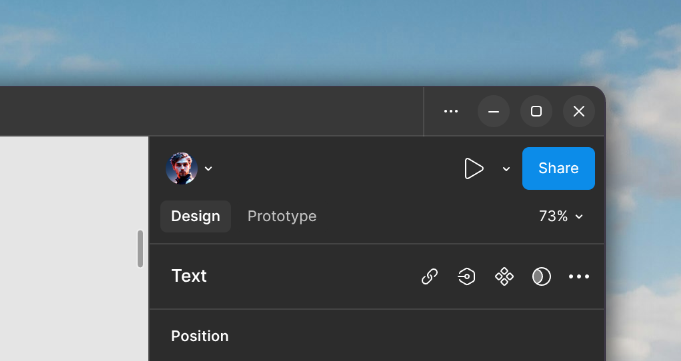

# Figma Desktop — GNOME Edition

Неофициальный форк [figma-linux](https://github.com/IliyaBrook/figma-linux) с патчами для нативного внешнего вида на GNOME и других DE.



---

## Что добавлено в этом форке

### Кнопки управления окном в стиле GNOME Adwaita

- **Меню (⋯)** — квадратная кнопка 24×24, без фона, фон появляется только при наведении
- **Свернуть / Развернуть / Закрыть** — круглые пилюли с постоянной тонкой подложкой
- Иконки — точные SVG из темы Adwaita (close, minimize, maximize, view-more)
- Все цвета через дизайн-токены Figma (`--color-bghovertransparent`, `--color-bgtransparent-secondary-*`, `--color-bg-danger-*`) — корректная перекраска в светлой и тёмной темах
- Кнопка закрытия краснеет при наведении (деструктивное действие)

### Исправления для Wayland / KDE Tiling

- Патч `getContentBounds()` обходит устаревший кэш Chromium — корректный ресайз при тайлинге и при разворачивании окна
- Повторная эмиссия события `resize` после maximize / fullscreen / unmaximize

### Прочее

- Патч duplicate tabs использует regex-паттерны — не ломается при обновлении Figma
- Пункт «Show App» в трей-меню
- Поддержка `FIGMA_USE_NATIVE_FRAME=1` для нативных декораций окна

---

## Скачать

AppImage скачивается со страницы **Releases** этого репозитория:

👉 **[Releases → lavdein/figma-linux-gnome](https://github.com/lavdein/figma-linux-gnome/releases)**

Скачай файл `Figma-*.AppImage`, сделай его исполняемым и запусти:

```bash
chmod +x Figma-*.AppImage
./Figma-*.AppImage
```

---

## Автообновление через Gear Lever

[Gear Lever](https://flathub.org/apps/it.mijorus.gearlever) — приложение для управления AppImage-файлами на GNOME. Умеет автоматически проверять и устанавливать обновления с GitHub Releases.

### Настройка

1. Установи Gear Lever из Flathub:
   ```bash
   flatpak install flathub it.mijorus.gearlever
   ```

2. Открой Gear Lever, перетащи туда скачанный `Figma-*.AppImage` — он установится в систему и появится в лаунчере.

3. Чтобы настроить автообновление:
   - Открой Gear Lever
   - Найди Figma в списке установленных приложений
   - Нажми на иконку шестерёнки (⚙) рядом с приложением
   - В поле **«Update source»** укажи URL GitHub Releases этого репозитория:
     ```
     https://github.com/lavdein/figma-linux-gnome/releases
     ```
   - Gear Lever будет проверять новые релизы и предлагать обновление одним кликом

---

## Сборка из исходников

Требования: `node 20+`, `p7zip`, `p7zip-plugins`, `imagemagick`

```bash
git clone https://github.com/lavdein/figma-linux-gnome.git
cd figma-linux-gnome
bash build.sh --build appimage
```

Готовый AppImage появится в папке `dist/`.

---

## Связанные проекты

- [IliyaBrook/figma-linux](https://github.com/IliyaBrook/figma-linux) — апстрим
- [Gear Lever на Flathub](https://flathub.org/apps/it.mijorus.gearlever)
