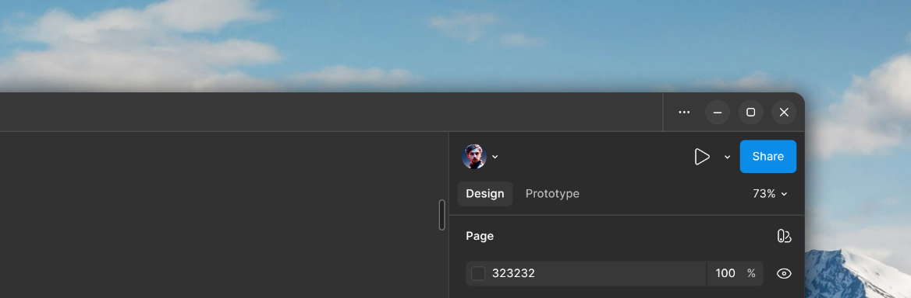
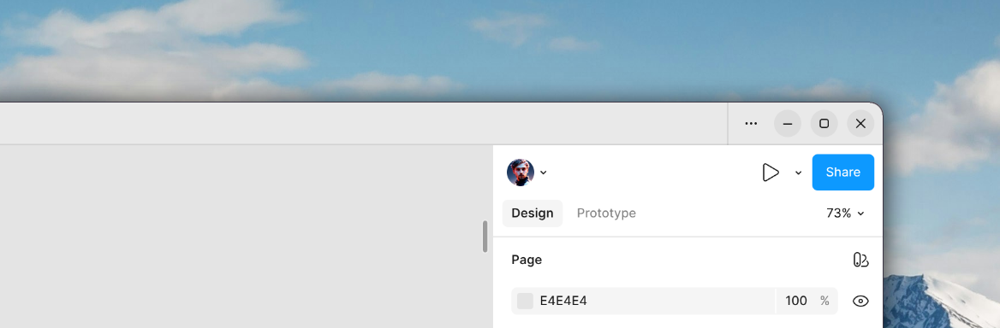

# Figma Desktop — GNOME Edition

Неофициальный форк [figma-linux](https://github.com/IliyaBrook/figma-linux) с патчами для нативного внешнего вида на GNOME и поддержкой системных шрифтов.

| Тёмная тема | Светлая тема |
|---|---|
|  |  |

---

## Особенности форка

### Кнопки управления окном в стиле GNOME Adwaita

- **Меню (⋯)** — квадратная кнопка, фон появляется только при наведении
- **Свернуть / Развернуть / Закрыть** — круглые, с постоянной тонкой подложкой
- Иконки — точные SVG из темы Adwaita
- Цвета через дизайн-токены Figma — корректная перекраска в светлой и тёмной теме

> Скруглённые углы окна пока реализованы через расширение GNOME
> **[Rounded Window Corners Reborn](https://extensions.gnome.org/extension/7048/rounded-window-corners-reborn/)**

### Агент системных шрифтов (Local Fonts Agent)

Figma Desktop включает агент локальных шрифтов только на Windows. На Linux этот форк подменяет User-Agent на Windows — Figma активирует агент и видит все шрифты, установленные в системе.

Для полноценной работы установи **[figma-agent-linux](https://github.com/neetly/figma-agent-linux)** — нативный агент шрифтов для Linux.

### Исправление ресайза на Wayland / тайлинг

Патч обходит устаревший кэш Chromium при изменении размера окна — корректная работа при KWin-тайлинге, разворачивании и полноэкранном режиме.

### Трей

Исправлено позиционирование трей-окна: на Wayland `getBounds()` возвращает `0,0`, форк вычисляет позицию по курсору мыши.

---

## Скачать

AppImage скачивается со страницы **Releases**:

👉 **[Releases → lavdein/figma-linux-gnome](https://github.com/lavdein/figma-linux-gnome/releases)**

```bash
chmod +x Figma-*.AppImage
./Figma-*.AppImage
```

---

## Автообновление через Gear Lever

[Gear Lever](https://flathub.org/apps/it.mijorus.gearlever) — менеджер AppImage для GNOME, умеет обновляться прямо с GitHub Releases.

```bash
flatpak install flathub it.mijorus.gearlever
```

1. Перетащи AppImage в Gear Lever — приложение появится в лаунчере
2. Открой настройки приложения (⚙) → **Update source**:
   ```
   https://github.com/lavdein/figma-linux-gnome/releases
   ```
3. Gear Lever будет предлагать обновление одним кликом при выходе нового релиза

---

## Сборка

```bash
git clone https://github.com/lavdein/figma-linux-gnome.git
cd figma-linux-gnome
bash build.sh --build appimage
```

Требования: `node 20+`, `p7zip`, `p7zip-plugins`, `imagemagick`

---

Апстрим: [IliyaBrook/figma-linux](https://github.com/IliyaBrook/figma-linux)
